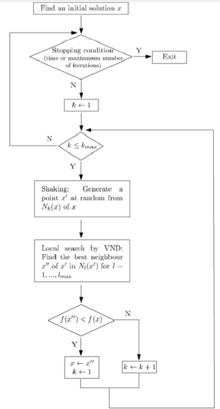
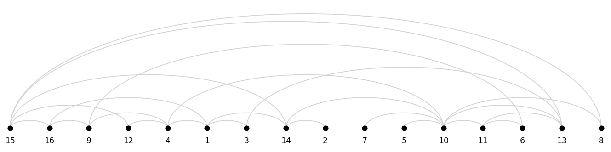

# Circuit Design

## Problem

I didn't tell you before, but I work pretty hard at Samsung ElectORnics.

We design and produce cutting-edge 💾 memory and logic chips.

A chip is full of components like logic gates, flip-flops and registers, functional blocks and input/output ports 🔌.

All of them are interconnected inside the chip.

Well, my job consists on improve that interconnection as much as possible to:

🕒 Reduce signal delay
⚡ Lower power comsumption
📉 Simplify wiring complexity
This helps extend the life of the chip.

I found a way to do that, though it's pretty hard when doing it by hand 🤯.

I place all the components in a linear layout, and I count how many interconnections there exist for each pair of consecutive components 🧮. It's like I draw a vertical line in every pair of consecutive components and I count how many wires cross that line.

Then I get the maximum of those, and I try to minimize that by 🔀 moving components along the linear layout.

When moving them, I need to recalculate some. I find solutions to the problem, but I think there might be a much better way to do it 🤔.

Can you help me solve this problem? 🧩

## Objective Function

Min Total Crossings

## Constraints

- Components must be in a linear layout
- *Could be added the max number of crossings for one connection*

## Optimization method

- Variable Neighbourhood Search (VNS)
  - Operators (Neighbourhoods): SWAP and INSERTION
  - Objective function implemented as a simple algorithm that gets the total number of crossings of a given solution and data (connections)
  

I got this solution after 10 minutes:

- Solution: [15, 16, 9, 12, 4, 1, 3, 14, 2, 7, 5, 10, 11, 6, 13, 8]
- Cost (Number of total crossings): 16

