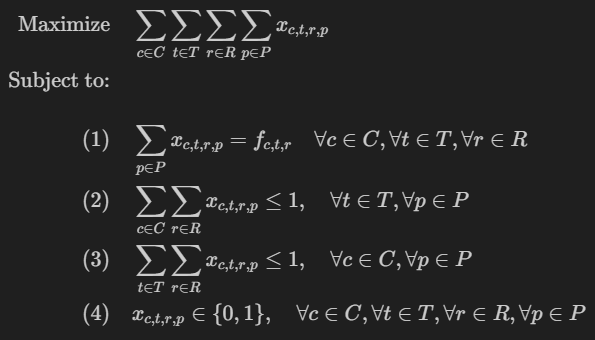

# Optimal timetables

## Problem

Hi, I'm SalvadOR, responsible for creating a school timetable to organize classes, teachers, and rooms for an upcoming semester.

We have some strict requirements to meet. This is a very hard problem we face every year, and I need your help to design an optimal timetable.

Here's the situation:

- There are 4 classes, each requiring specific teaching sessions.
- There are 4 teachers, and each teacher has assigned subjects to teach.
- There are 4 rooms, and only one class can occupy a room during any given period.
- 
The timetable spans 30 periods, and we must ensure that all requirements are met without any conflicts or overlaps.

I desperately need a timetable that satisfies all requirements (each class meets with the right teacher in the right room the required number of times), avoiding any type of clashes such as double-booking a teacher, room, or class during the same period.

We say a timetable is optimized when it minimizes idle periods and maximizes resource utilization (teachers and rooms).

## Objective Function

Max Scheduled Classes (Max Resource Utilization)

## Constraints

Refering to the model below:

1. Comply with how often each class-teacher combination needs to meet in specific rooms
2. Only one teacher assigned to one room and class each period
3. Only one class assigned to one teacher and room each period
4. Decision variable nature

## Optimization method: Mathematical Model (MILP) 

- Modelled in Pyomo model
- Solved with GLPK

